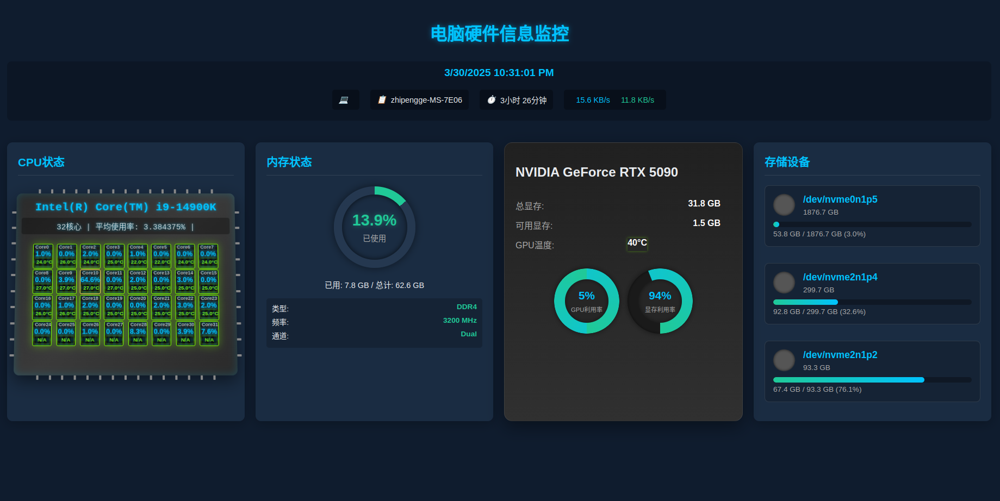

<think>
我需要创建一个README文件，介绍这个硬件监控系统的功能、部署方式以及使用方法。基于我之前看到的代码和功能，我可以概括出以下内容：

1. 项目简介：这是一个基于Web的硬件监控系统，用于实时监控计算机硬件性能。
2. 功能特性：
   - CPU监控（利用率、温度、频率）
   - 内存监控（使用情况、频率、类型）
   - GPU监控（利用率、显存使用、温度）
   - 磁盘使用情况
   - 网络速度监控
   - 系统信息（主机名、运行时间）
3. 技术栈：
   - 后端：Flask（Python）
   - 前端：HTML/CSS/JavaScript
   - 硬件信息收集：psutil, GPUtil, cpuinfo等Python库
4. 部署说明：
   - 环境要求
   - 安装步骤
   - 运行指令
5. 界面预览：提及images/hw_info.png图片
6. 注意事项和已知问题
7. 贡献和许可信息

我会以这个结构来编写README.md。
</think>

# 硬件监控系统 (Hardware Monitor)



## 项目简介

硬件监控系统是一个基于Web的实时硬件性能监控工具，提供直观的可视化界面，帮助用户实时了解计算机硬件状态和性能数据。系统采用轻量级设计，资源占用少，适合在后台长期运行进行硬件监控。

## 主要功能

- **CPU监控**
  - 实时CPU利用率（总体和每核心）
  - CPU温度监控（支持多核心温度显示）
  - CPU频率信息
  - 芯片式可视化布局，直观展示多核心状态

- **内存状态**
  - 内存使用率圆环可视化
  - 内存总量和已用量
  - 内存类型、频率和通道信息

- **GPU监控**
  - GPU利用率圆环可视化
  - 显存使用率圆环可视化
  - GPU温度实时监控
  - 支持多GPU系统

- **存储设备监控**
  - 磁盘使用情况
  - 分区信息和使用率
  
- **网络监控**
  - 实时上传/下载速度
  - 自动单位换算(B/s, KB/s, MB/s)

- **系统信息**
  - 主机名
  - 系统运行时间

## 技术栈

- **后端**: Python (Flask)
- **前端**: HTML/CSS/JavaScript
- **数据采集**: 
  - psutil (CPU, 内存, 磁盘, 网络)
  - GPUtil (GPU信息)
  - py-cpuinfo (CPU详细信息)
  - py-sensors (温度监控)

## 安装与部署

### 环境要求

- Python 3.8+
- pip 或 pipenv

### 依赖安装

使用pipenv (推荐):

```bash
pipenv install
```

或者使用pip:

```bash
pip install -r requirements.txt
```

### 运行方式

1. 启动服务器:

```bash
python app.py
```

2. 在浏览器中访问:

```
http://localhost:5000
```

### Docker部署 (可选)

```bash
# 构建Docker镜像
docker build -t hardware-monitor .

# 运行容器
docker run -d -p 5000:5000 --name hw-monitor hardware-monitor
```

## 自启动配置

### Linux系统 (使用systemd)

1. 创建服务文件:

```bash
sudo nano /etc/systemd/system/hardware-monitor.service
```

2. 添加以下内容:

```
[Unit]
Description=Hardware Monitor Service
After=network.target

[Service]
User=<your_username>
WorkingDirectory=/path/to/hardware-monitor
ExecStart=/path/to/python /path/to/hardware-monitor/app.py
Restart=always

[Install]
WantedBy=multi-user.target
```

3. 启用并启动服务:

```bash
sudo systemctl enable hardware-monitor
sudo systemctl start hardware-monitor
```

### Windows系统

可以通过任务计划程序设置开机自启动:

1. 打开任务计划程序
2. 创建基本任务
3. 触发器设置为"计算机启动时"
4. 操作选择"启动程序"，选择python.exe并添加参数"app.py"和起始位置

## 注意事项

- GPU监控功能需要安装NVIDIA驱动和相关工具
- 某些温度和频率信息获取可能需要管理员/root权限
- 建议定期清理浏览器缓存以获取最新数据
- 页面每5秒自动刷新一次数据

## 已知问题

- 在某些虚拟环境中，部分硬件信息可能无法获取
- 不同操作系统可能显示的信息有所不同
- AMD GPUs可能信息不完整

## 许可证

MIT License

---

如有问题或建议，请提交Issues或Pull Request。您的贡献将使这个项目变得更好！
