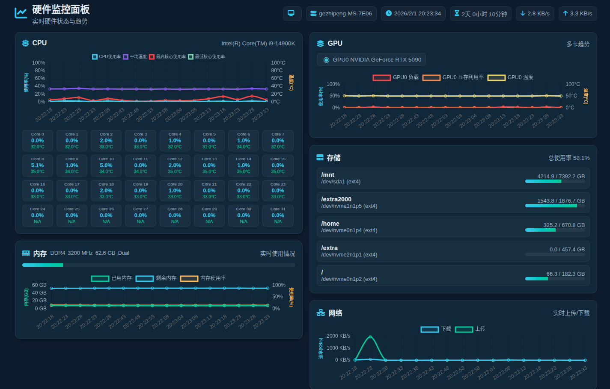

# 硬件监控系统 (Hardware Monitor)

## 项目简介

基于 Flask 的硬件监控面板，实时展示 CPU、内存、GPU、磁盘与网络状态，并提供趋势曲线。界面采用统一卡片布局，移动端单列、桌面端双列。


## 主要功能

- **CPU**
  - 总使用率、平均温度、最高/最低核心使用率曲线
  - 8 列核心网格，显示每核心使用率与温度
- **内存**
  - 已用/剩余内存曲线（GB）+ 使用率曲线（%）
  - 标题栏展示内存类型、频率、总量与通道
- **GPU**
  - 多卡单选
  - 单图表展示负载/显存利用率/温度曲线
- **存储**
  - 仅统计可用磁盘（>50GB）总使用率
  - 挂载点维度的磁盘列表与使用进度
- **网络**
  - 顶部实时显示上传/下载速率
  - 速率趋势曲线
- **系统信息**
  - 操作系统、主机名、运行时间

## 技术栈

- **后端**: Python (Flask)
- **前端**: HTML/CSS/JavaScript + Chart.js
- **数据采集**:
  - psutil (CPU/内存/磁盘/网络)
  - GPUtil (GPU)
  - py-cpuinfo (CPU 详细信息)

## 安装与运行

### 环境要求

- Python 3.8+
- pip 或 pipenv

### 依赖安装

使用 pipenv（推荐）:

```bash
pipenv install
```

或使用 pip:

```bash
pip install -r requirements.txt
```

### 启动

```bash
python app.py
```

浏览器访问:

```
http://localhost:5000
```

## 注意事项

- GPU 监控需要安装 NVIDIA 驱动与相关工具
- 温度/频率信息在部分系统下可能需要管理员权限
- 前端默认每 5 秒刷新一次数据
